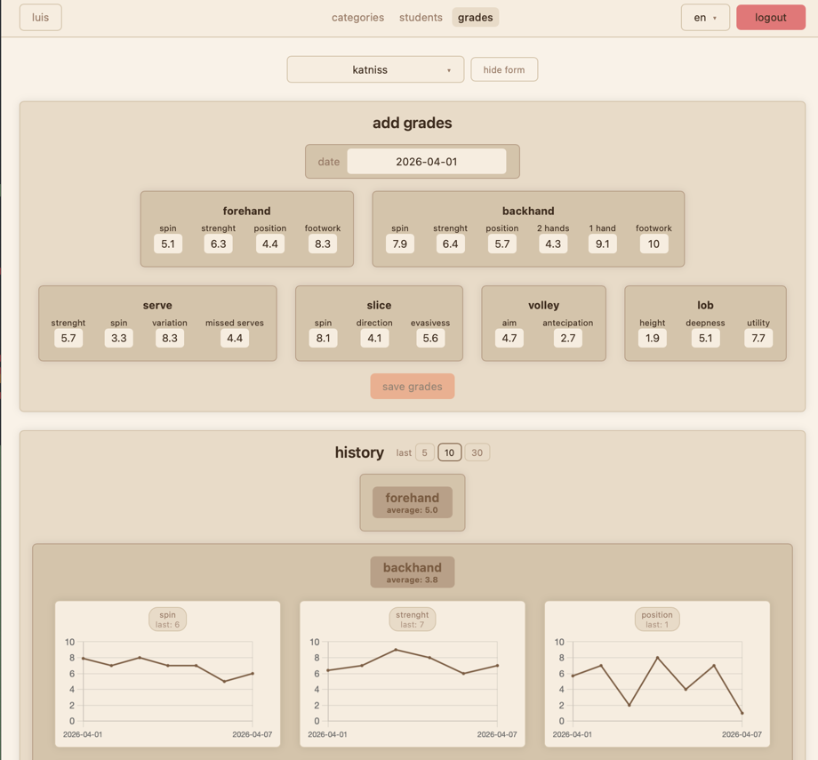

# grade tracker

track student grades across categories and subcategories, with per-subcategory line charts



## stack

- **backend**: python, flask, sqlalchemy, sqlite; pytest for tests
- **frontend**: vue 3 (script setup), vite, vue-router, vue-i18n, chart.js; vitest for tests
- **infra**: docker, nginx (reverse proxy, rate limiting, static file serving)

## run (local)

```bash
cd backend && uv sync
cd frontend && npm install
```

```bash
cd backend && uv run python run.py   # http://localhost:5000
cd frontend && npm run dev           # http://localhost:5173
```

open http://localhost:5173

## run (docker)

```bash
docker compose up --build # start always rebuilding
docker compose down -v    # stop and reset volumes
```

open http://localhost

works without `.env`, using the defaults below. to set your own values, copy `.env.example` to `.env` and edit it:

```bash
cp .env.example .env
```

## env vars

| var            | default                 | used in                                                    |
|----------------|-------------------------|------------------------------------------------------------|
| `SECRET_KEY`   | `dev-default-value`     | flask session signing                                      |
| `ADMIN_PASS`   | `admin-pass`            | initial admin password (set on first run)                  |
| `FLASK_HOST`   | `127.0.0.1`             | flask bind address; set to `0.0.0.0` in docker via compose |
| `FLASK_DEBUG`  | `1`                     | reloader and debugger; set to `0` in docker via compose    |

## roles

| role    | lands on              | can do                                  |
|---------|-----------------------|-----------------------------------------|
| admin   | `/admin/teachers`     | create and delete teacher accounts      |
| teacher | `/teacher/categories` | manage categories, students, and grades |
| student | `/student`            | view own grades as charts               |

default admin account: `admin` / `admin-pass`; password can be changed from the admin screen.

## entities

- **category**: top-level grouping (e.g. serve)
- **subcategory**: belongs to a category (e.g. slice); each gets its own line chart
- **grade**: value 0.0–10.0 with one decimal, tied from a teacher to a student + subcategory + date

## test

```bash
cd backend && uv run pytest
cd frontend && npm test
```

## codebase guides

- [BACK_READ.md](BACK_READ.md), [FRONT_READ.md](FRONT_READ.md) and [INFRA_READ.md](INFRA_READ.md): beginner-friendly
  guides for navigating the codebase
- [FRONT_BASICS.md](FRONT_BASICS.md): frontend concepts from scratch (node, npm, vite, vue, router, css); read
  before FRONT_READ.md if frontend is new to you
- [TODO.md](TODO.md): known improvements and future work
